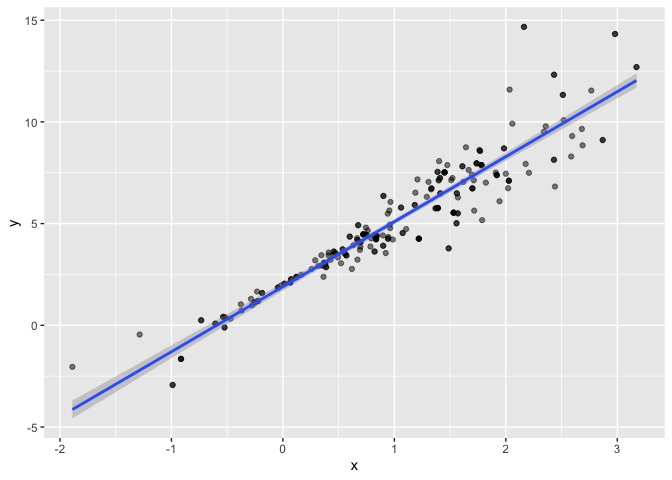
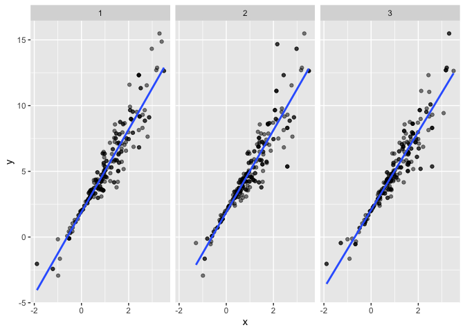
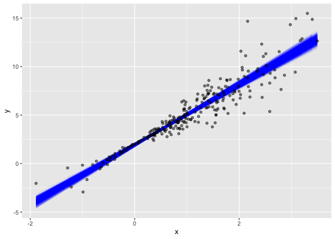
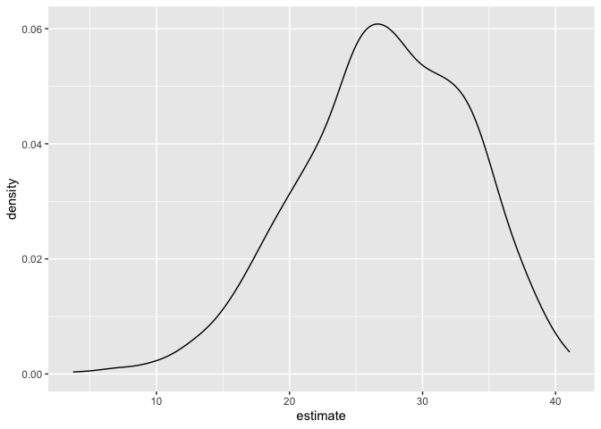

Bootstrapping
================
Xue Zhang
2023-11-16

# Generate a relevant example

``` r
n_samp = 250

sim_df_const = 
  tibble(
    x = rnorm(n_samp, 1, 1),
    error = rnorm(n_samp, 0, 1),
    y = 2 + 3 * x + error)

sim_df_nonconst = sim_df_const |>
  mutate(
    error = error * .75 * x,
    y = 2 + 3 * x + error
  )
```

``` r
sim_df =
  bind_rows(const = sim_df_const, nonconst = sim_df_nonconst, .id = "data_source")

sim_df |>
  ggplot(aes(x = x, y = y)) +
  geom_point(alpha = .5) +
  stat_smooth(method = "lm") +
  facet_grid(~data_source)
```

    ## `geom_smooth()` using formula = 'y ~ x'

<!-- -->

``` r
lm(y ~x, data = sim_df_const) |>
  broom::tidy() |>
  knitr::kable(digits = 3)
```

| term        | estimate | std.error | statistic | p.value |
|:------------|---------:|----------:|----------:|--------:|
| (Intercept) |    1.977 |     0.098 |    20.157 |       0 |
| x           |    3.045 |     0.070 |    43.537 |       0 |

``` r
lm(y ~ x, data = sim_df_nonconst) |>
  broom::tidy() |>
  knitr::kable(digits = 3)
```

| term        | estimate | std.error | statistic | p.value |
|:------------|---------:|----------:|----------:|--------:|
| (Intercept) |    1.934 |     0.105 |    18.456 |       0 |
| x           |    3.112 |     0.075 |    41.661 |       0 |

# Drawing one bootstrap sample

``` r
boot_sample = function(df) {
  sample_frac(df, replace = TRUE)
}
```

``` r
boot_sample(sim_df_nonconst) |>
  ggplot(aes(x = x, y = y)) +
  geom_point(alpha = .5) +
  stat_smooth(method = "lm")
```

    ## `geom_smooth()` using formula = 'y ~ x'

<!-- -->

# Drawing many bootstrap samples

``` r
boot_straps =
  tibble(strap_number = 1:1000) |>
  mutate(
    strap_sample = map(strap_number, \(i) boot_sample(df = sim_df_nonconst))
  )

boot_straps
```

    ## # A tibble: 1,000 × 2
    ##    strap_number strap_sample      
    ##           <int> <list>            
    ##  1            1 <tibble [250 × 3]>
    ##  2            2 <tibble [250 × 3]>
    ##  3            3 <tibble [250 × 3]>
    ##  4            4 <tibble [250 × 3]>
    ##  5            5 <tibble [250 × 3]>
    ##  6            6 <tibble [250 × 3]>
    ##  7            7 <tibble [250 × 3]>
    ##  8            8 <tibble [250 × 3]>
    ##  9            9 <tibble [250 × 3]>
    ## 10           10 <tibble [250 × 3]>
    ## # ℹ 990 more rows

``` r
boot_straps |>
  slice(1:3) |>
  mutate(strap_sample = map(strap_sample, arrange, x)) |>
  pull(strap_sample)
```

    ## [[1]]
    ## # A tibble: 250 × 3
    ##         x   error       y
    ##     <dbl>   <dbl>   <dbl>
    ##  1 -1.89   1.62   -2.04  
    ##  2 -1.89   1.62   -2.04  
    ##  3 -1.21  -0.781  -2.43  
    ##  4 -1.21  -0.781  -2.43  
    ##  5 -1.00   0.832  -0.169 
    ##  6 -0.989 -1.97   -2.93  
    ##  7 -0.914 -0.908  -1.65  
    ##  8 -0.606 -0.106   0.0774
    ##  9 -0.536  0.0227  0.413 
    ## 10 -0.524 -0.536  -0.106 
    ## # ℹ 240 more rows
    ## 
    ## [[2]]
    ## # A tibble: 250 × 3
    ##         x  error       y
    ##     <dbl>  <dbl>   <dbl>
    ##  1 -1.29   1.40  -0.454 
    ##  2 -0.989 -1.97  -2.93  
    ##  3 -0.914 -0.908 -1.65  
    ##  4 -0.914 -0.908 -1.65  
    ##  5 -0.805  0.292 -0.123 
    ##  6 -0.805  0.292 -0.123 
    ##  7 -0.665 -0.544 -0.539 
    ##  8 -0.641 -0.416 -0.338 
    ##  9 -0.606 -0.106  0.0774
    ## 10 -0.606 -0.106  0.0774
    ## # ℹ 240 more rows
    ## 
    ## [[3]]
    ## # A tibble: 250 × 3
    ##         x  error      y
    ##     <dbl>  <dbl>  <dbl>
    ##  1 -1.89   1.62  -2.04 
    ##  2 -1.89   1.62  -2.04 
    ##  3 -1.29   1.40  -0.454
    ##  4 -1.29   1.40  -0.454
    ##  5 -1.00   0.832 -0.169
    ##  6 -0.914 -0.908 -1.65 
    ##  7 -0.805  0.292 -0.123
    ##  8 -0.665 -0.544 -0.539
    ##  9 -0.665 -0.544 -0.539
    ## 10 -0.665 -0.544 -0.539
    ## # ℹ 240 more rows

``` r
boot_straps |>
  slice(1:3) |>
  unnest(strap_sample) |>
  ggplot(aes(x = x, y = y)) +
  geom_point(alpha = .5) +
  stat_smooth(method = "lm", se = FALSE) +
  facet_grid(~strap_number)
```

    ## `geom_smooth()` using formula = 'y ~ x'

<!-- -->

# Analyzing bootstrap samples

``` r
bootstrap_results =
  boot_straps |>
  mutate(
    models = map(strap_sample, \(df) lm(y ~ x, data = df)),
    results = map(models, broom::tidy)) |>
  select(-strap_sample, -models) |>
  unnest(results)
```

try to summarize these results – get a bootstrap SE

``` r
bootstrap_results |>
  group_by(term) |>
  summarize(boot_se = sd(estimate)) |>
  knitr::kable(digits = 3)
```

| term        | boot_se |
|:------------|--------:|
| (Intercept) |   0.075 |
| x           |   0.101 |

``` r
bootstrap_results |>
  group_by(term) |>
  summarize(
    ci_lower = quantile(estimate, 0.025),
    ci_upper = quantile(estimate, 0.975))
```

    ## # A tibble: 2 × 3
    ##   term        ci_lower ci_upper
    ##   <chr>          <dbl>    <dbl>
    ## 1 (Intercept)     1.79     2.08
    ## 2 x               2.91     3.31

``` r
boot_straps |>
  unnest(strap_sample) |>
  ggplot(aes(x = x, y = y)) +
  geom_line(aes(group = strap_number), stat = "smooth", method = "lm", se = FALSE, alpha = .1, color = "blue") +
  geom_point(data = sim_df_nonconst, alpha = .5)
```

    ## `geom_smooth()` using formula = 'y ~ x'

<!-- -->

`bootstrap`

``` r
boot_straps =
  sim_df_nonconst |>
  modelr::bootstrap(n = 1000)

boot_straps |>
  pull(strap) |>
  nth(1)
```

    ## <resample [250 x 3]> 8, 132, 69, 225, 180, 122, 34, 170, 216, 122, ...

``` r
boot_straps |>
  pull(strap) |>
  nth(1) |>
  as_tibble()
```

    ## # A tibble: 250 × 3
    ##         x  error     y
    ##     <dbl>  <dbl> <dbl>
    ##  1  1.74   0.747  7.96
    ##  2  0.411  0.343  3.58
    ##  3  1.15  -1.12   4.34
    ##  4 -0.157 -0.159  1.37
    ##  5  2.21  -1.13   7.50
    ##  6  2.34   0.488  9.52
    ##  7  0.946 -0.498  4.34
    ##  8  1.21   1.55   7.17
    ##  9  2.52   0.528 10.1 
    ## 10  2.34   0.488  9.52
    ## # ℹ 240 more rows

``` r
sim_df_nonconst |>
  modelr::bootstrap(n = 1000) |>
  mutate(
    models = map(strap, \(df) lm(y ~ x, data = df)),
    results = map(models, broom::tidy)) |>
  select(-strap, -models) |>
  unnest(results) |>
  group_by(term) |>
  summarize(boot_se = sd(estimate))
```

    ## # A tibble: 2 × 2
    ##   term        boot_se
    ##   <chr>         <dbl>
    ## 1 (Intercept)  0.0790
    ## 2 x            0.104

``` r
sim_df_const |>
  modelr::bootstrap(n = 1000) |>
  mutate(
    models = map(strap, \(df) lm(y ~ x, data = df)),
    results = map(models, broom::tidy)) |>
  select(-strap, -models) |>
  unnest(results) |>
  group_by(term) |>
  summarize(boot_se = (estimate))
```

    ## Warning: Returning more (or less) than 1 row per `summarise()` group was deprecated in
    ## dplyr 1.1.0.
    ## ℹ Please use `reframe()` instead.
    ## ℹ When switching from `summarise()` to `reframe()`, remember that `reframe()`
    ##   always returns an ungrouped data frame and adjust accordingly.
    ## Call `lifecycle::last_lifecycle_warnings()` to see where this warning was
    ## generated.

    ## `summarise()` has grouped output by 'term'. You can override using the
    ## `.groups` argument.

    ## # A tibble: 2,000 × 2
    ## # Groups:   term [2]
    ##    term        boot_se
    ##    <chr>         <dbl>
    ##  1 (Intercept)    1.87
    ##  2 (Intercept)    2.04
    ##  3 (Intercept)    2.19
    ##  4 (Intercept)    2.02
    ##  5 (Intercept)    2.03
    ##  6 (Intercept)    2.16
    ##  7 (Intercept)    2.00
    ##  8 (Intercept)    1.98
    ##  9 (Intercept)    1.99
    ## 10 (Intercept)    1.94
    ## # ℹ 1,990 more rows

# Airbnb data

``` r
data("nyc_airbnb")

nyc_airbnb = 
  nyc_airbnb |>
  mutate(stars = review_scores_location / 2) |>
  rename(
    borough = neighbourhood_group,
    neighborhood = neighbourhood) |>
  filter(borough != "Staten Island") |>
  drop_na(price, stars) |>
  select(price, stars, borough, neighborhood, room_type)
```

Let’s fit a regression of `price` on other variables and look at
residuals

``` r
nyc_airbnb |>
  ggplot(aes(x = stars, y = price, color = room_type)) +
  geom_point()
```

<!-- -->

``` r
nyc_airbnb |>
  filter(borough == "Manhattan") |>
  modelr::bootstrap(n = 1000) |>
  mutate(
    models = map(strap, \(df) lm(price ~ stars + room_type, data = df)),
    results = map(models, broom::tidy) ) |>
  select(results) |>
  unnest(results) |>
  filter(term == "stars") |>
  ggplot(aes(x = estimate)) + geom_density()
```

<!-- -->
