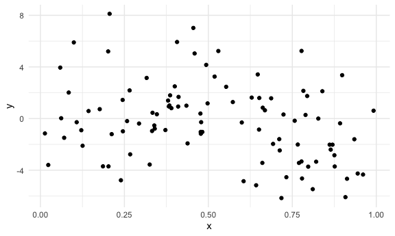
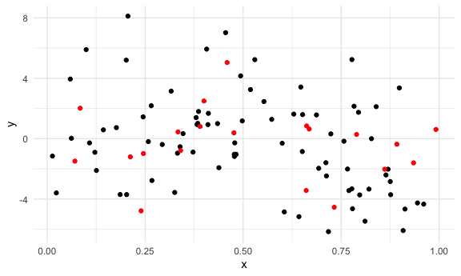
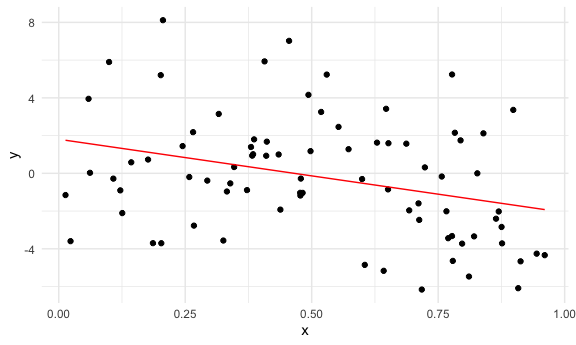
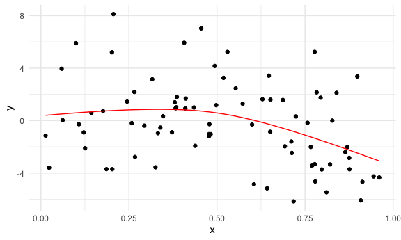
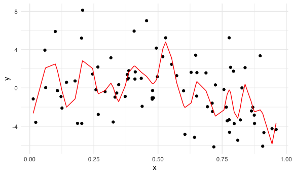
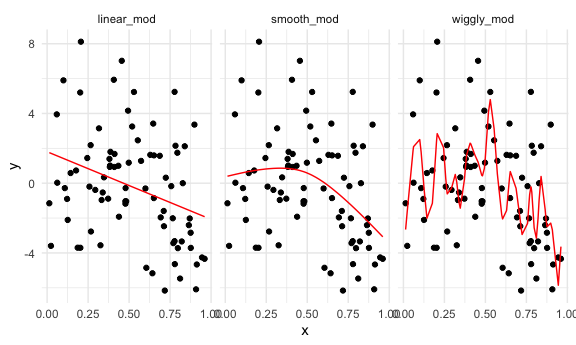
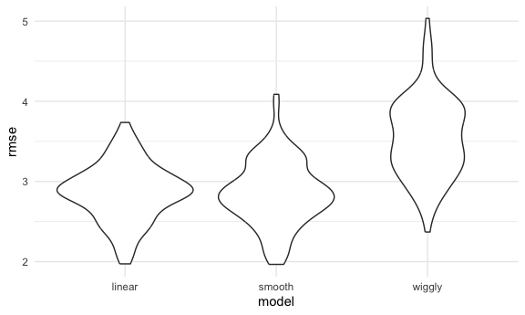
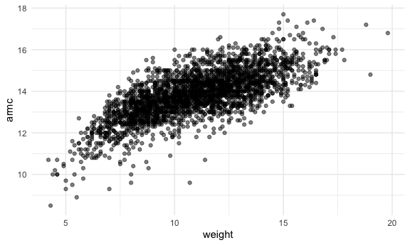
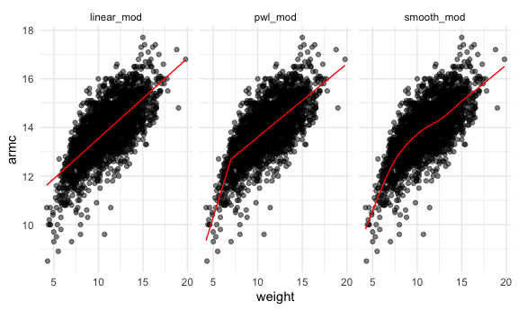
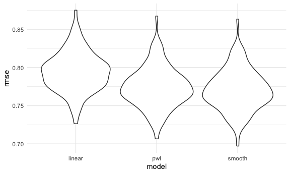

Cross Validation
================
Xue Zhang
2023-11-14

``` r
set.seed(1)
```

CV “by hand”

``` r
nonlin_df =
  tibble(
    id = 1:100,
    x = runif(100, 0, 1),
    y = 1 - 10 * (x - .3) ^ 2 + rnorm(100, 0, 3)
  )

nonlin_df |>
  ggplot(aes(x = x, y = y)) +
  geom_point()
```



Do the train / test split.

``` r
train_df = sample_n(nonlin_df, 80)
test_df = anti_join(nonlin_df, train_df, by = "id")

ggplot(train_df, aes(x = x, y = y)) +
  geom_point() +
  geom_point(data = test_df, color = "red")
```



``` r
linear_mod = lm(y ~ x, data = train_df)
smooth_mod = mgcv::gam(y ~ s(x), data = train_df)
wiggly_mod = mgcv::gam(y ~ s(x, k = 30), sp = 10e-6, data = train_df)
```

quick visualization of the linear model

``` r
train_df |>
  modelr::add_predictions(linear_mod) |>
  ggplot(aes(x = x, y = y)) +
  geom_point() +
  geom_line(aes(y = pred), color = "red")
```



``` r
train_df |>
  modelr::add_predictions(smooth_mod) |>
  ggplot(aes(x = x, y = y)) +
  geom_point() +
  geom_line(aes(y = pred), color = "red")
```



``` r
train_df |>
  modelr::add_predictions(wiggly_mod) |>
  ggplot(aes(x = x, y = y)) +
  geom_point() +
  geom_line(aes(y = pred), color = "red")
```



``` r
train_df |>
  gather_predictions(linear_mod, smooth_mod, wiggly_mod) |>
  mutate(model = fct_inorder(model)) |>
  ggplot(aes(x = x, y =y)) +
  geom_point() +
  geom_line(aes(y = pred), color = "red") +
  facet_wrap(~model)
```



RMSE on resting data gives a sense of out-of-sample prediction accuracy!

``` r
rmse(linear_mod, test_df)
```

    ## [1] 2.421457

``` r
rmse(smooth_mod, test_df)
```

    ## [1] 2.434229

``` r
rmse(wiggly_mod, test_df)
```

    ## [1] 2.886916

CV using`modelr`

``` r
cv_df = 
  crossv_mc(nonlin_df, 100)
```

``` r
cv_df |>
  pull(train) |>
  nth(1) |>
  as_tibble()
```

    ## # A tibble: 79 × 3
    ##       id      x       y
    ##    <int>  <dbl>   <dbl>
    ##  1     1 0.266   2.18  
    ##  2     2 0.372  -0.888 
    ##  3     3 0.573   1.28  
    ##  4     4 0.908  -6.09  
    ##  5     6 0.898   3.36  
    ##  6     7 0.945  -4.26  
    ##  7     8 0.661  -3.43  
    ##  8     9 0.629   1.63  
    ##  9    10 0.0618  0.0274
    ## 10    11 0.206   8.12  
    ## # ℹ 69 more rows

``` r
cv_df |>
  pull(test) |>
  nth(1) |>
  as_tibble()
```

    ## # A tibble: 21 × 3
    ##       id      x      y
    ##    <int>  <dbl>  <dbl>
    ##  1     5 0.202   5.20 
    ##  2    12 0.177   0.730
    ##  3    19 0.380   1.40 
    ##  4    22 0.212  -1.21 
    ##  5    28 0.382   0.935
    ##  6    31 0.482  -1.04 
    ##  7    37 0.794   1.75 
    ##  8    42 0.647   3.42 
    ##  9    47 0.0233 -3.60 
    ## 10    56 0.0995  5.90 
    ## # ℹ 11 more rows

``` r
cv_df = 
  cv_df |>
  mutate(
    train = map(train, as_tibble),
    test = map(test, as_tibble)
  )
```

``` r
cv_df =
  cv_df |>
  mutate(
    linear_mod = map(train, ~lm(y ~ x, data = .x)),
    smooth_mod = map(train, ~mgcv::gam( y ~ s(x), data = .x)),
    wiggly_mod = map(train, ~gam(y ~s(x, k = 30), sp = 10e-6, data = .x))) |>
  mutate(
    rmse_linear = map2_dbl(linear_mod, test, ~rmse(model = .x, data = .y)),
    rmse_smooth = map2_dbl(smooth_mod, test, ~rmse(model = .x, data = .y)),
    rmse_wiggly = map2_dbl(wiggly_mod, test, ~rmse(model = .x, data = .y)))
```

``` r
cv_df |>
  select(starts_with("rmse")) |>
  pivot_longer(
    everything(),
    names_to = "model",
    values_to = "rmse",
    names_prefix = "rmse_"
  ) |>
  mutate(model = fct_inorder(model)) |>
  ggplot(aes(x = model, y = rmse)) + geom_violin()
```



Example: Child Growth

``` r
child_growth = read_csv("./data/nepalese_children.csv")
```

    ## Rows: 2705 Columns: 5
    ## ── Column specification ────────────────────────────────────────────────────────
    ## Delimiter: ","
    ## dbl (5): age, sex, weight, height, armc
    ## 
    ## ℹ Use `spec()` to retrieve the full column specification for this data.
    ## ℹ Specify the column types or set `show_col_types = FALSE` to quiet this message.

``` r
child_growth |>
  ggplot(aes(x = weight, y = armc)) +
  geom_point(alpha = .5)
```



``` r
child_growth =
  child_growth |>
  mutate(weight_cp = (weight > 7) * (weight - 7))
```

``` r
linear_mod = lm(armc ~ weight, data = child_growth)
pwl_mod = lm(armc ~ weight + weight_cp, data = child_growth)
smooth_mod = gam(armc ~ s(weight), data = child_growth)
```

``` r
child_growth |>
  gather_predictions(linear_mod, pwl_mod, smooth_mod) |>
  mutate(model = fct_inorder(model)) |>
  ggplot(aes(x = weight, y = armc)) +
  geom_point(alpha = .5) +
  geom_line(aes(y = pred), color = "red") +
  facet_grid(~model)
```



``` r
cv_df =
  crossv_mc(child_growth, 100) |>
  mutate(
    train = map(train, as_tibble),
    test = map(test, as_tibble)
  )
```

``` r
cv_df = 
  cv_df |>
  mutate(
    linear_mod = map(train, ~lm(armc ~ weight, data = .x)),
    pwl_mod = map(train, ~lm(armc ~ weight + weight_cp, data = .x)),
    smooth_mod = map(train, ~gam(armc ~ s(weight), data = as_tibble(.x)))
  ) |>
  mutate(
    rmse_linear = map2_dbl(linear_mod, test, ~rmse(model = .x, data = .y)),
    rmse_pwl = map2_dbl(pwl_mod, test, ~rmse(model = .x, data = .y)),
    rmse_smooth = map2_dbl(smooth_mod, test, ~rmse(model = .x, data = .y))
  )
```

``` r
cv_df |>
  select(starts_with("rmse")) |>
  pivot_longer(
    everything(),
    names_to = "model",
    values_to = "rmse",
    names_prefix = "rmse_"
  ) |>
  mutate(model = fct_inorder(model)) |>
  ggplot(aes(x = model, y = rmse)) + geom_violin()
```


